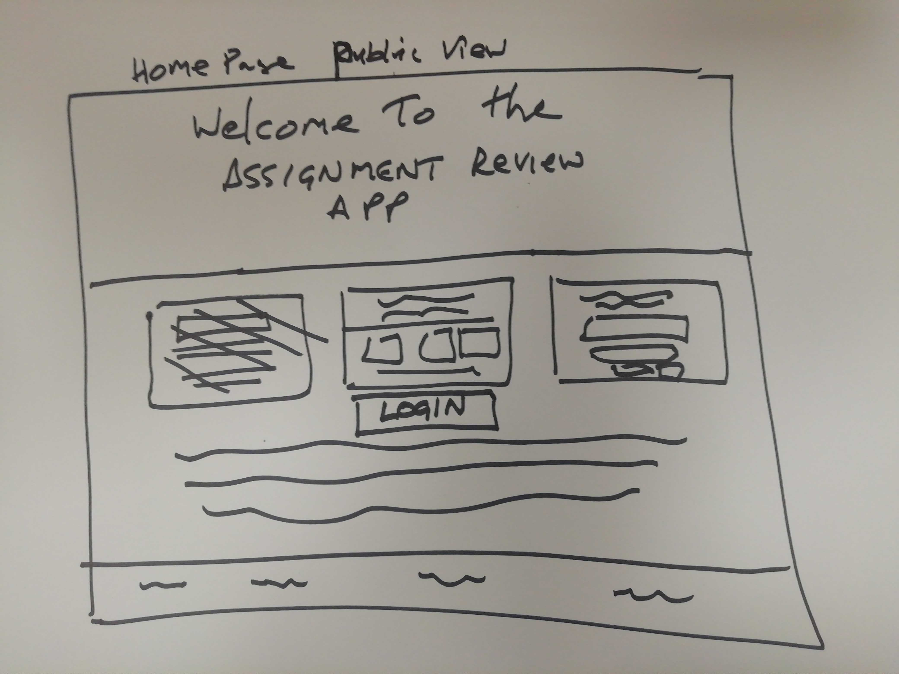
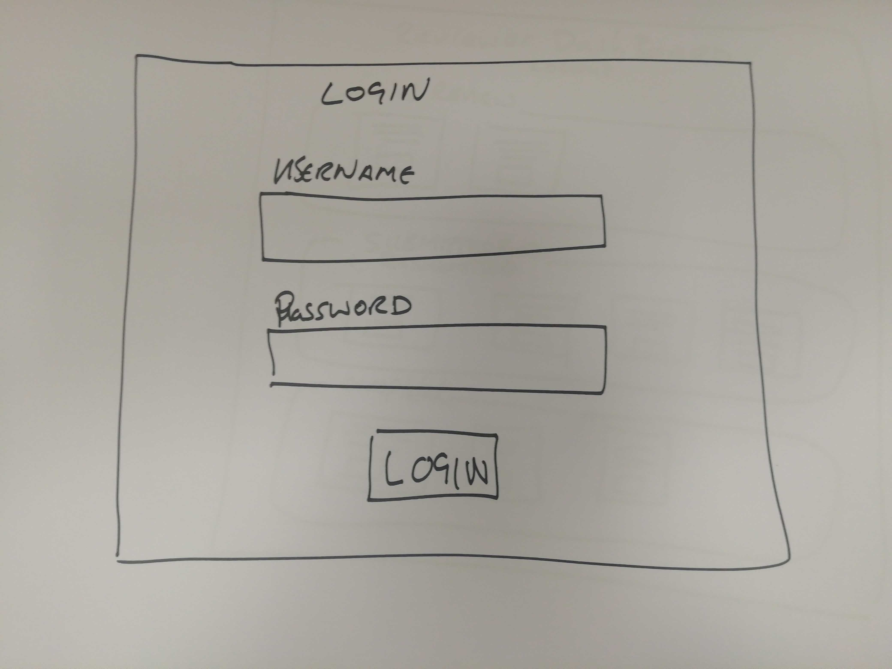
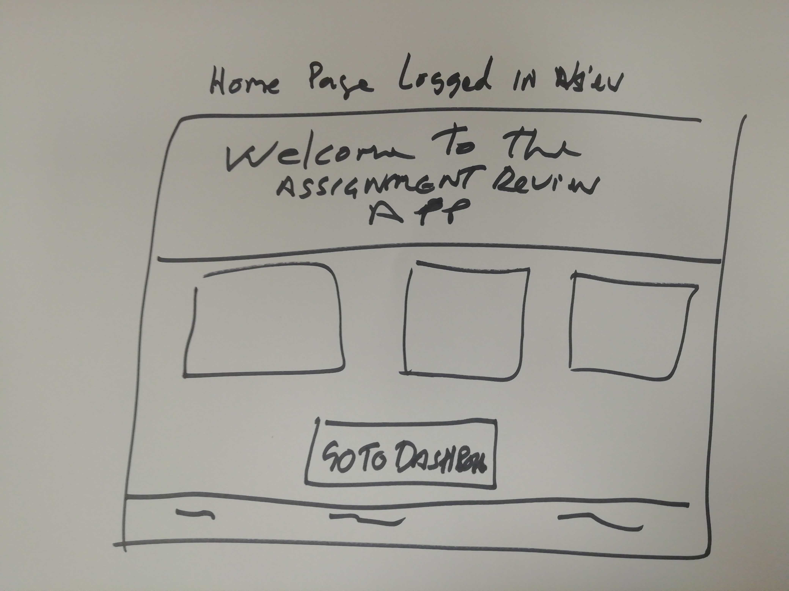
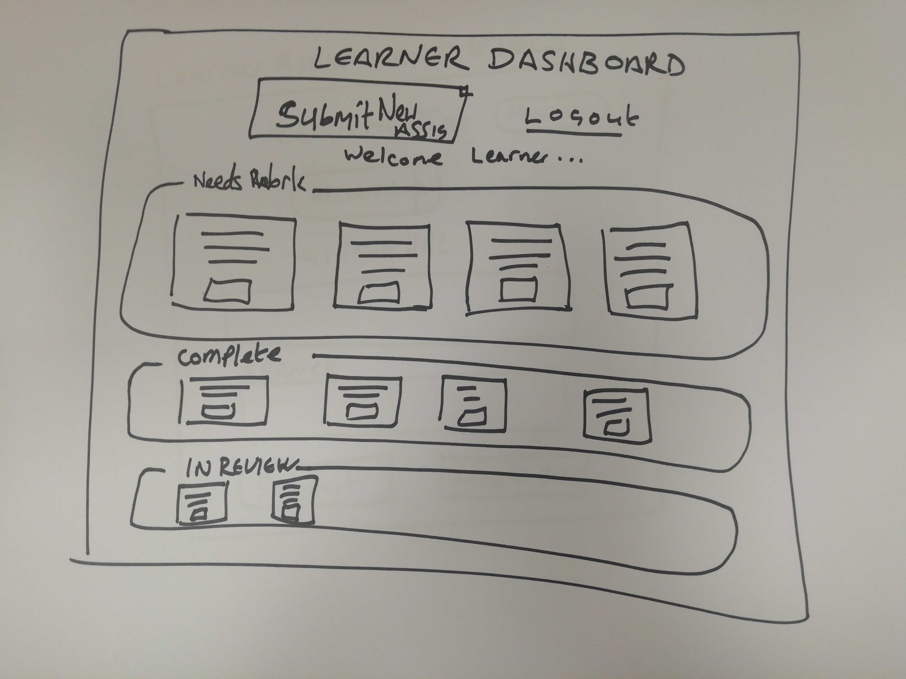
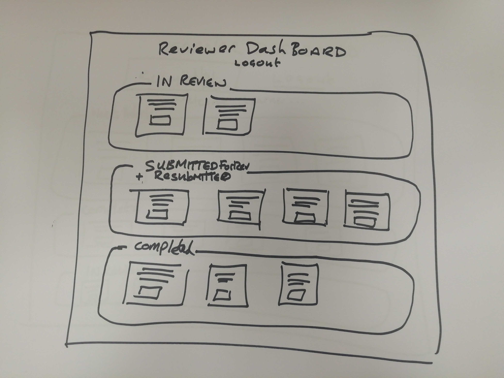
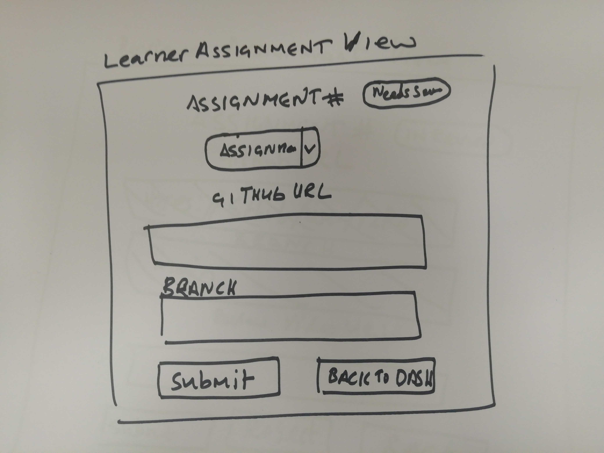
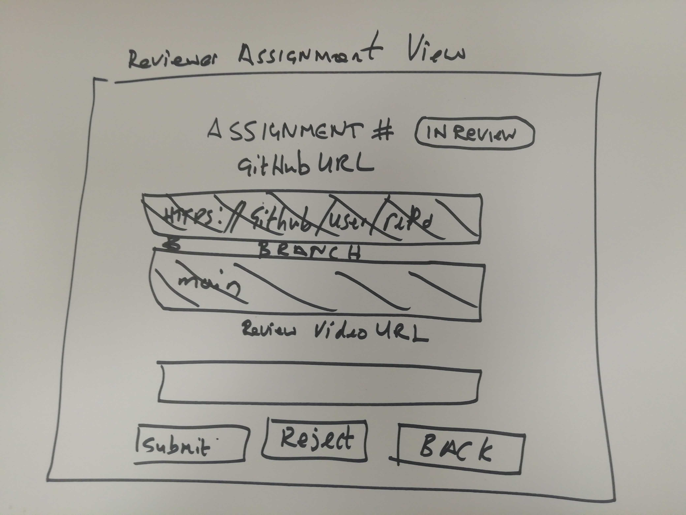

# Codecamp

## Synopsis
A learning Management System to keep track of learners assignments. This is a solutions for a learner to submit assignments and
get them reviewed.

## User Stories
### Learner User Stories
- As a Learner I want to be able to register to the application.
- As a Learner I want to be able to log in to the app and be presented with a dashboard.
- As a learner I want a dashboard that shows all of my currently working on, submitted, rejected, and completed assignments.
- As a Learner I want to be able to click on a `Create Assignment` button on my dashboard and be presented with a form to allow me to submit an assignment with room for my GitHub url and the branch I am working on.
- As a Learner I want to be able to click on an `Edit` button on one of the assignments on my dashboard to edit and resubmit it if it was returned unfinished.
- As a Learner I want to be able to click on a `View` button on a completed assignment on my dashboard and be able to view a review video for the given assignment.
- As a Learner I want to be able to view the 4 most recent of each assignment by status and click on `view all` to see a list of all of my completed assignments.
- As a Learner I cannot have more than 10 `Unassigned` assignments at a time.
- As a Learner I cannot have more than 10 assignments `In review` at a time.
- As a Learner I cannot have more than 10 assignments that `Needs work` at a time.

### Reviewer User Stories
- As a Reviewer I want to be able to receive a registration link to register as a reviewer.
- As a Reviewer I want to be able to log in to the app and be presented with a dashboard.
- As a Reviewer I want to be able to see any submitted assignments on my dashboard ready to claim.
- As a Reviewer I want to be able to click on a `claim` button on an assignment with `Submitted` status in my dashboard to claim it ready for review.
- As a Reviewer I want to be able to be able to click a `View` button on one of my claimed assignments and get a detail view of the assignment ready to review.
- As a Reviewer I want to be able to click a `Needs work` button in an assignment view to reject a learners assignment submission which will change that assignment status to needs work for the learner.
- As a Reviewer I want to be able to click on a `Complete` button to mark it as complete.
- As a Reviewer I want to be able to see the 4 most recent `Submitted` assignments and click on `view all` for a list of all-of-the submitted assignments.
- As a Reviewer I cannot have more than 10 assignments that are `In review`.

### Admin User Stories
- As an admin I want to be able to receive a registration link to register as an admin.
- As an admin I want to be able to access an admin portal.
- As an admin I want to be able to get a list of all users in the system.
- As an admin I want to be able to edit a user's information from the admin portal.
- As an admin I want to be able to change a user's permissions.
- As an admin I want to be able to disable a user's access.
- As an admin I want to be able to get a list of all assignments.
- As an admin I want to be able to edit an assignment.
- As an admin I want to be abe to view a quick summary of a learner's progress.
- As an admin I want to be abe to view a quick summary of a reviewer's progress.

## Technology Stack
- **Frontend:** `React JS`
- **Backend API:** `Spring Boot with Spring Data JPA with Hibernate and the PostgreSQL Driver`
- **Security and Auth:** `Spring Security using JWT for user persistence`
- **Database:** `PostgreSQL server for a relational database`

## Domain Objects (Entities / DTO / ENUM)
### User
- id : Long
- cohortStartDate: Date
- firstname: String
- lastname: String
- username: String
- password: String
- authorities: List<Authority>

### Authority
- id: Long
- authority: String
- user: User

### Assignment
- id: Long
- number: Integer
- name: String
- description: String
- status: String
- githubUrl: String
- branch: String
- reviewVideoUrl: String
- creationTime: LocalDateTime
- lastUpdated: LocalDateTime
- user: User
- codeReviewer: User

### DTOs
- AssignmentResponseDto
- UserResponseDto
- AuthCredentialRequest

### Enums
- AssignmentEnum
- AssignmentStatusEnum
- AuthorityEnum

## Database Tables
- users
- authorities
- contact
- address
- assignment

### users
- id : number
- cohort_start_date: date
- first_name: String
- last_name: String
- user_name: varchar
- password: varchar

### authorities
- id: number
- authority: varchar
- user_id: number

### contact
- id: number
- phone: varchar
- email: varchar
- user_id: number

### address
- id: number
- street: varchar
- number: varchar
- city: varchar
- state: varchar
- zipcode: varchar
- user_id: number

### assignments
- id: number
- number: number
- github_url: varchar
- branch: varchar
- code_review_video_url: varchar
- user_id: number
- code_reviewer_id: number

## Restful Endpoints
| Endpoints  | Method                | CRUD | Mapping                       | 
|:-----------|:----------------------|:----:|:------------------------------|
| user       | attemptAuthentication | Post | `/api/auth/login`             |
| user       | createUser            | Post | `/api/create/user`            |
| user       | validate              | Get  | `/api/auth/validate`          |
| user       | Get user              | Get  | `/api/user/`                  |   
| user       | updateUser            | Get  | `/api/user/`                  |  
| admin      | getAllUsers           | Get  | `/api/user/{username}`        |
| admin      | getUserByUsername     | Get  | `/api/user/{username}`        |
| admin      | updateUser            | Put  | `/api/admin/user/{username}`  |
| Assignment | getUserAssignmentList | Get  | `/api/assignments`            |
| Assignment | getAssignment         | Get  | `/api/assignments/{id}`       |
| Assignment | updateAssignment      | Put  | `/api/assignments/{id}`       |
| Assignment | createAssignment      | Post | `/api/assignments`            |

## Models
### Create learner
        {
        "firstname": "Charles",
        "lastname": "Bronson",
        "username": "learner2",
        "password": "@Password1",
        "authorities": ["LEARNER"],
        "address" : {
            "street": "123 main st",
            "number": "",
            "city": "Atlanta",
            "state": "GA",
            "zipcode": "30033"
            },
        "contact": {
            "phone": "0123258521",

            "email": "cbronson@mailDomain.com"
            }
        }

### Create reviewer
        {
        "firstname": "Jean-Claude",
        "lastname": "Van Damme",
        "username": "reviewer1",
        "password": "@Password1",
        "authorities": ["REVIEWER"],
        "address" : {
            "street": "123 main st",
            "number": "12",
            "city": "Orlando",
            "state": "FL",
            "zipcode": "32835"
            },
        "contact": {
            "phone": "0123258521",
            "email": "jcvd@mailDomain.com"
            }
        }

### Create assignment
        {
        "name": "Project name",
        "description": "Project description",
        "githubUrl": "https://projectGithubUrl.com/",
        "branch": "Branch name"
        }

## Handling:
### Assignment
#### Assignment status
- For assignments that are in `Submited` status, the backend handles the status change on the learner's side.
- For assignments that are being reviewed by the reviewer, the status change is handled by the frontend based on if the assignment needs to be in a `Completed` or `In review` status.

#### Edit assignment
- A user can only edit the Github Url and the branch of an assignment
- A reviewer can only edit the reviewer video url of an assignment

#### Cohort start date/time management
- The backend converts the Local time to UTC and saved to the database.
- The frontend will receive that time in UTC and convert it to the user's local time.

### User
#### User registration
- For User registration, authorities are handled by the frontend. a different page is set for reviewer registration.
  - Authorities are defined as `LEARNER` `REVIEWER` `ADMIN`

## Wireframes
### Home Page (Public)

### Login Page

### Home Page (Authenticated)

### Learner Dashboard

### Reviewer Dashboard

### Learner Assignment View

### Reviewer Assignment View

